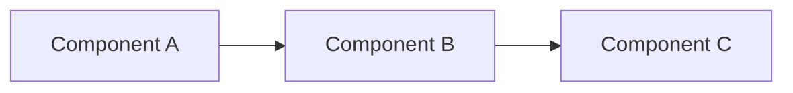

# [Concept Title]
<!-- Example: How Windows Print Architecture Works -->
<!-- Example: What Is Conditional Access and How Does It Work? -->

## Metadata

| Field | Value |
|---|---|
| Category | [Technology Area] / Concept |
| Last Updated | YYYY-MM-DD |
| Sources | SRC-XXX, Microsoft Docs, Vendor Manual |

## One-Line Summary

> Explain it like you're telling a colleague in the elevator in 15 seconds.
> Example: "PaperCut intercepts print jobs between the Windows Spooler and the
> printer to enforce quotas, track costs, and enable secure release."

## Why This Matters

<!-- Why should someone care about understanding this concept? -->
<!-- What breaks if you don't understand it? -->

## How It Works

### Overview

<!-- High-level explanation (2-3 paragraphs) -->

### Architecture Diagram

<!-- Draw or describe the architecture -->
<!-- Use mermaid diagrams if possible -->



### Key Components

| Component | Role | Where It Runs |
|---|---|---|
| Component 1 | What it does | Server / Client / Cloud |
| Component 2 | What it does | Server / Client / Cloud |

### Data Flow (Step by Step)

```
1. User does X
2. System does Y
3. Component Z processes it
4. Result is delivered
```

### Ports & Protocols

| Port | Protocol | Purpose |
|---|---|---|
| XXXX | TCP | Description |
| YYYY | TCP/UDP | Description |

## Key Facts to Remember

<!-- Bullet-point reference sheet — the things you need to recall quickly -->
- Fact 1
- Fact 2
- Fact 3

## Common Misconceptions

| Misconception | Reality |
|---|---|
| "X does Y" | Actually, X does Z because... |

## How This Connects to Other Systems

<!-- Which How-To and Troubleshoot entries depend on understanding this concept? -->

### Depends On (Upstream)
- [Prerequisite concept 1](./prerequisite.md)

### Used By (Downstream)
- [How-To: Setup printer on PaperCut](../How-To/setup-brand-new-printer-on-papercut.md)
- [Troubleshoot: Jobs stuck in queue](../Troubleshoot/jobs-stuck-in-queue.md)

## Further Reading

- [Vendor documentation link]
- [Microsoft Learn link]
- [Community resource link]
