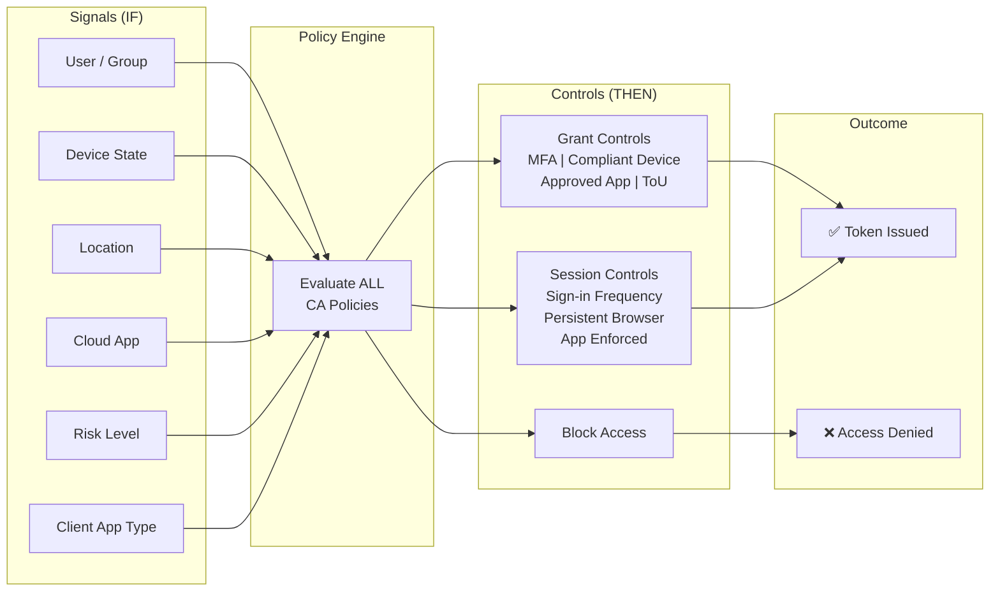

# What Is Conditional Access & How Does It Work?

## Metadata

| Field        | Value                                                  |
| ------------ | ------------------------------------------------------ |
| Category     | Identity & Access / Concept                            |
| Last Updated | 2026-04-10                                             |
| Sources      | _(Add source IDs — LinkedIn courses, Microsoft Learn)_ |

## One-Line Summary

> Conditional Access is Entra ID's Zero Trust policy engine — it evaluates signals (user, device, location, risk) at sign-in time and enforces controls (MFA, compliant device, block) before issuing a token.

## Why This Matters

* CA is the **enforcement point** for Zero Trust — without understanding it, you can't secure cloud access
* Misconfigurations can **lock out the entire org** (block-all scenario) or leave **security gaps** (legacy auth bypass)
* Every identity-related How-To and Troubleshoot entry in this KB depends on understanding CA fundamentals

## How It Works

### Overview

Conditional Access operates on an **if-then** model:

* **IF** a set of conditions (assignments) are met during a sign-in...
* **THEN** enforce specific access controls

**Critical behaviour**: Policies are **additive**. ALL matching policies apply simultaneously. **Block always wins** over Grant.

### Architecture Diagram



### Policy Evaluation Logic

```
1. User initiates sign-in to a cloud app
2. Entra ID collects signals: who, what device, where from, which app, risk level
3. ALL CA policies are evaluated (not first-match — ALL matching policies apply)
4. For each policy:
   ├── Do Assignments match? (users + apps + conditions)
   │   ├── NO → policy is skipped
   │   └── YES → collect the required controls
5. Aggregate all required controls from all matching policies:
   ├── If ANY policy says BLOCK → Access Denied (block always wins)
   ├── If controls required → user must satisfy ALL of them
   │   (e.g., MFA AND compliant device if both are required by different policies)
   └── If no policies match → Allow (unless Security Defaults are on)
6. User satisfies controls → Token issued with appropriate claims
7. Everything logged in Sign-in Logs
```

## Key Facts to Remember

* **Block always wins** — if any matching policy blocks, access is denied regardless of other policies
* **Policies are additive** — controls from ALL matching policies are combined
* **Report-Only mode** — test policies without affecting users (shows what WOULD happen in sign-in logs)
* **Licensing**: P1 = basic CA; P2 = risk-based CA (sign-in risk, user risk)
* **Break-glass accounts** must be excluded from ALL CA policies — this is non-negotiable
* **Legacy authentication** (Basic auth, IMAP, SMTP, POP) cannot perform MFA — must be blocked separately
* CA policies apply at **sign-in time**, not continuously — a signed-in session persists until the token expires

## Common Misconceptions

| Misconception                                        | Reality                                                                                                          |
| ---------------------------------------------------- | ---------------------------------------------------------------------------------------------------------------- |
| "CA is like a firewall — first matching rule wins"   | ALL matching policies apply. Controls are aggregated. Block wins.                                                |
| "If I create an 'allow' policy, it overrides blocks" | No. You cannot override a block with an allow. Block always wins.                                                |
| "CA continuously monitors sessions"                  | CA evaluates at sign-in (token issuance). Use Continuous Access Evaluation (CAE) for near-real-time enforcement. |
| "MFA = Conditional Access"                           | MFA is one possible _control_. CA is the _engine_ that decides when to require it.                               |
| "All apps support CA"                                | Only apps that use Entra ID for authentication. On-prem apps need Application Proxy.                             |

## How This Connects to Other Systems

### Depends On (Upstream)

* Entra ID (identity provider)
* Intune (device compliance state)
* Entra Connect (hybrid identity sync)
* Authentication Methods (MFA registration)

### Used By (Downstream)

* [How-To: Create a CA policy from scratch](../how-to-guides/create-conditional-access-policy-from-scratch.md)
* [How-To: Block legacy authentication](../../Identity-Access/How-To/block-legacy-authentication.md)
* [How-To: Require MFA for all users](../../Identity-Access/How-To/require-mfa-for-all-users.md)
* [Troubleshoot: User blocked by CA](../../Identity-Access/Troubleshoot/user-blocked-by-ca-policy.md)

## Further Reading

* [Microsoft Learn: Plan a Conditional Access deployment](https://learn.microsoft.com/en-us/entra/identity/conditional-access/plan-conditional-access)
* [Microsoft Learn: Common CA policies](https://learn.microsoft.com/en-us/entra/identity/conditional-access/concept-conditional-access-policy-common)
* [Microsoft Learn: Troubleshoot CA sign-in issues](https://learn.microsoft.com/en-us/entra/identity/conditional-access/troubleshoot-conditional-access)
