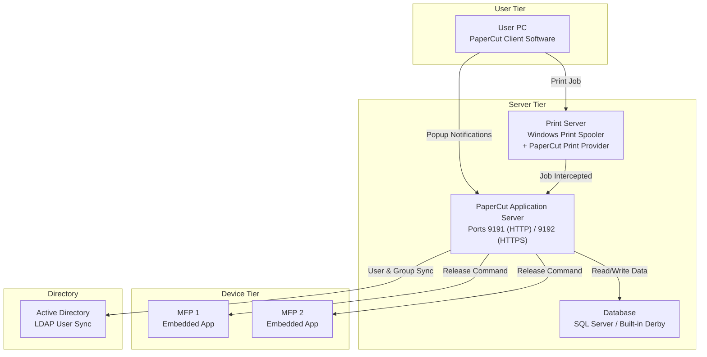

# PaperCut Architecture & Components

## Metadata

| Field        | Value                                                      |
| ------------ | ---------------------------------------------------------- |
| Category     | Print Management / Concept                                 |
| Last Updated | 2026-04-10                                                 |
| Sources      | _(Add your source IDs — PaperCut Manual, company KB docs)_ |

## One-Line Summary

> PaperCut sits between the Windows Print Spooler and your printers to intercept every print job — enforcing quotas, tracking costs, and enabling secure release at the device via badge swipe.

## Why This Matters

* If you don't understand PaperCut's components, you can't troubleshoot print failures — you won't know where in the chain the problem lies
* Every How-To and Troubleshoot entry in the Print Management section depends on this foundational knowledge
* Understanding the architecture lets you design HA setups, plan migrations, and size infrastructure correctly

## How It Works

### Overview

PaperCut consists of several components that work together to manage the print lifecycle. The **Application Server** is the brain — it stores configuration, user data, and quota information. The **Print Provider** is the integration point with Windows — it hooks into the Print Spooler to intercept and track jobs. The **Client Software** runs on user PCs to provide popup notifications and confirmations. The **Embedded Apps** run on MFP devices to enable secure print release.

### Architecture Diagram



### Key Components

| Component              | Role                                                                     | Where It Runs                                                 | Key Detail                                   |
| ---------------------- | ------------------------------------------------------------------------ | ------------------------------------------------------------- | -------------------------------------------- |
| **Application Server** | Central brain — config, policies, web admin console, API                 | Dedicated server or same as Print Server                      | Ports 9191 (HTTP), 9192 (HTTPS)              |
| **Print Provider**     | Hooks into Windows Print Spooler to intercept jobs                       | On every Print Server                                         | Communicates with App Server on port 9193    |
| **Database**           | Stores users, groups, quotas, job logs, config                           | SQL Server (production) or built-in Derby (small deployments) | Derby is NOT recommended for production      |
| **Client Software**    | User-facing popups: quota warnings, job confirmations, account selection | Installed on every user PC                                    | Deployed via GPO, SCCM, or Intune            |
| **Embedded App**       | Runs on MFP touchscreen for secure release, copy/scan tracking           | MFP device firmware                                           | Device-specific — check compatibility matrix |
| **Web Admin Console**  | Management interface for admins                                          | Accessed via browser → App Server                             | `https://server:9191/admin`                  |
| **User Web Portal**    | Self-service for users: check balance, transaction history               | Accessed via browser → App Server                             | `https://server:9191/user`                   |
| **Mobility Print**     | BYOD / mobile print discovery (mDNS/DNS-SD)                              | Service on App Server                                         | Enables printing without driver install      |

### Data Flow (User Prints a Document)

```
1. User clicks Print → OS sends job to the Print Queue
2. Print Spooler receives the job
3. PaperCut Print Provider INTERCEPTS the job before it goes to the device
4. Print Provider sends job metadata to the PaperCut Application Server (port 9193)
5. Application Server checks:
   a. Does this user exist? (synced from AD)
   b. Does the user have quota remaining?
   c. Does the job comply with policies? (max pages, colour restrictions, duplex rules)
6. Decision:
   ├── DENY → Job deleted, user notified via Client popup
   ├── ALLOW (direct print) → Job sent to device immediately
   └── HOLD (secure release) → Job stored on server, waiting for device release
7. If HELD: User walks to MFP → authenticates (badge/PIN)
   → Embedded App calls PaperCut API → "show held jobs for this user"
   → User selects jobs → Release → jobs sent to device
8. Device prints the job
9. PaperCut logs: user, printer, pages, colour/BW, cost, timestamp
10. User's quota balance is decremented
```

### Ports & Protocols

| Port    | Protocol | Direction                   | Purpose                               |
| ------- | -------- | --------------------------- | ------------------------------------- |
| 9191    | HTTP     | Client → Server             | Web admin and user portal             |
| 9192    | HTTPS    | Client → Server             | Secure web admin and user portal      |
| 9193    | TCP      | Print Provider → App Server | Job data and control communication    |
| 631     | TCP      | Server → Device             | IPP (Internet Printing Protocol)      |
| 515     | TCP      | Server → Device             | LPR/LPD (legacy)                      |
| 9100    | TCP      | Server → Device             | RAW/JetDirect printing                |
| 161     | UDP      | Server → Device             | SNMP monitoring (toner, paper levels) |
| 389/636 | TCP      | Server → AD                 | LDAP / LDAPS user sync                |

## Key Facts to Remember

* PaperCut **does not replace** the Windows Print Spooler — it works **alongside** it by intercepting jobs via the Print Provider
* The Print Provider must be installed on **every** Print Server, not just the Application Server
* The Application Server and Print Server can be the **same machine** (common in small environments) or **separate** (recommended for larger deployments)
* User sync from AD is **one-way** — PaperCut reads from AD, never writes to it
* The built-in Derby database is for testing/small deployments only — production should use SQL Server or PostgreSQL
* PaperCut MF = full-featured (multi-function device support, embedded apps). PaperCut NG = simpler (no embedded apps)

## Common Misconceptions

| Misconception                                                   | Reality                                                                                                             |
| --------------------------------------------------------------- | ------------------------------------------------------------------------------------------------------------------- |
| "PaperCut is the print server"                                  | PaperCut is a **management layer** on top of the existing Windows Print infrastructure                              |
| "If PaperCut goes down, printing stops"                         | Depends on config — in many setups, jobs will print but won't be tracked/charged. Secure Release will stop working. |
| "PaperCut needs to be on the same server as the printer queues" | App Server and Print Server can be separate. The Print Provider bridges them.                                       |
| "PaperCut handles the print driver"                             | Drivers are managed by Windows Print Management. PaperCut just intercepts the job.                                  |

## How This Connects to Other Systems

### Depends On (Upstream)

* [How Windows Print Architecture Works](how-windows-print-architecture-works.md) — PaperCut builds on top of this
* Active Directory — user/group sync
* DNS — hostname resolution for servers and devices
* Network infrastructure — ports must be open between all components

### Used By (Downstream)

* [How-To: Set up a brand new printer on PaperCut](../how-to-guides/setup-brand-new-printer-on-papercut.md)
* [How-To: Configure Secure Print Release](../../Print-Management/How-To/configure-secure-print-release.md)
* [How-To: Configure print quotas](../../Print-Management/How-To/configure-print-quotas-and-restrictions.md)
* [Troubleshoot: PaperCut not tracking jobs](../../Print-Management/Troubleshoot/papercut-not-tracking-jobs.md)
* [Troubleshoot: Badge release not working](../../Print-Management/Troubleshoot/badge-release-not-working.md)

## Further Reading

* [PaperCut MF Manual — Architecture](https://www.papercut.com/help/manuals/mf/)
* [PaperCut Knowledge Base](https://www.papercut.com/kb/)
* [PaperCut Supported Printers/MFPs](https://www.papercut.com/discover/mfd-compatibility/)
